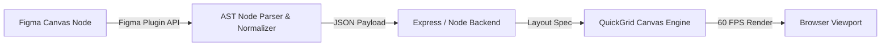
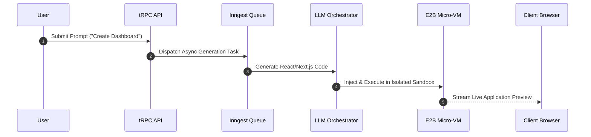
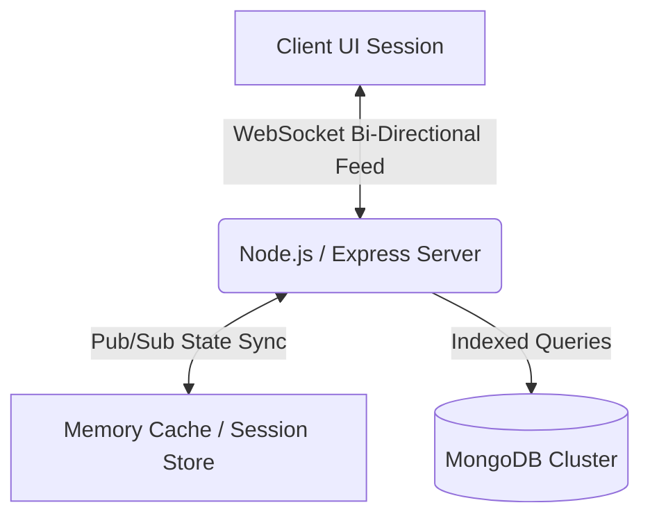

# 🏛️ Commercial Engineering & Production Case Studies

This repository showcases commercial-grade web platforms, distributed AI workflows, and enterprise design engines built for live production environments.

Each case study breaks down system architecture, core engineering challenges, technical stacks, and production outcomes.

---

## 📋 Table of Contents
1. [QuickGrid — Vector Translation Engine & Figma Plugin](#1-quickgrid--vector-translation-engine--figma-plugin)
2. [Vibe — Autonomous AI Web Provisioning Engine](#2-vibe--autonomous-ai-web-provisioning-engine)
3. [Terapage — Collaborative AI Research Workspace](#3-terapage--collaborative-ai-research-workspace)
4. [54 Crates — High-Throughput Media Platform](#4-54-crates--high-throughput-media-platform)

---

## 1. QuickGrid — Vector Translation Engine & Figma Plugin
* **Production URL:** [quickgrid.ai](https://staging-quickgridai-dashboard.axtrastudios.com/)
* **Domain:** Creative Tech / Canvas Rendering / Figma Extensions
* **Tech Stack:** `React.js` `TypeScript` `Node.js` `Figma Plugin API` `Abstract Syntax Trees (AST)`

### 🛠️ Architecture & Core Engineering



---

## 2. Vibe — Autonomous AI Web Provisioning Engine
* **Production URL:** [vibe-ten-cyan.vercel.app](https://vibe-ten-cyan.vercel.app)
* **Domain:** Cloud-Native / Generative AI / Sandboxed Execution
* **Tech Stack:** `Next.js 15` `React 19` `TypeScript` `Prisma` `tRPC` `Inngest` `E2B Sandboxes` `Clerk`

### 🛠️ System Architecture



---

## 3. Terapage — Collaborative AI Research Workspace
* **Production URL:** [app.terapage.ai](https://app.terapage.ai)
* **Domain:** Distributed Workspace / AI Research Platform
* **Tech Stack:** `React.js` `Node.js` `Express.js` `MongoDB` `WebSockets`

### 🛠️ System Architecture



---

## 4. 54 Crates — High-Throughput Media Platform
* **Production URL:** [54crates.com](https://54crates.com)
* **Domain:** Digital Media / Streaming & Curation
* **Tech Stack:** `Next.js` `TypeScript` `Tailwind CSS` `RESTful APIs`

### 🛠️ System Architecture

```mermaid
flowchart LR
    A[User Search Query] -->|Debounced Fetch| B[Next.js Server API / Cache]
    B -->|Indexed Search| C[Audio Asset DB]
    C -->|Track Payload| D[Global Playback State Machine]
    D -->|Uninterrupted Audio| E[Browser Audio API]
